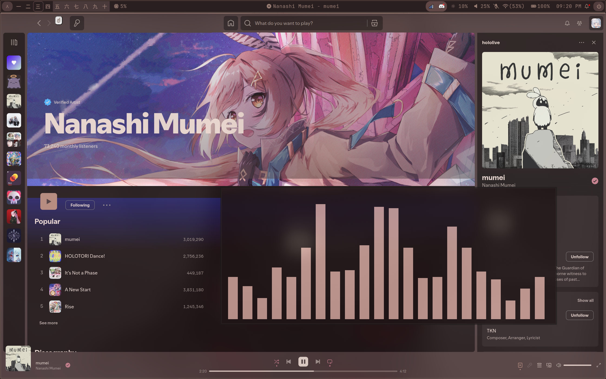
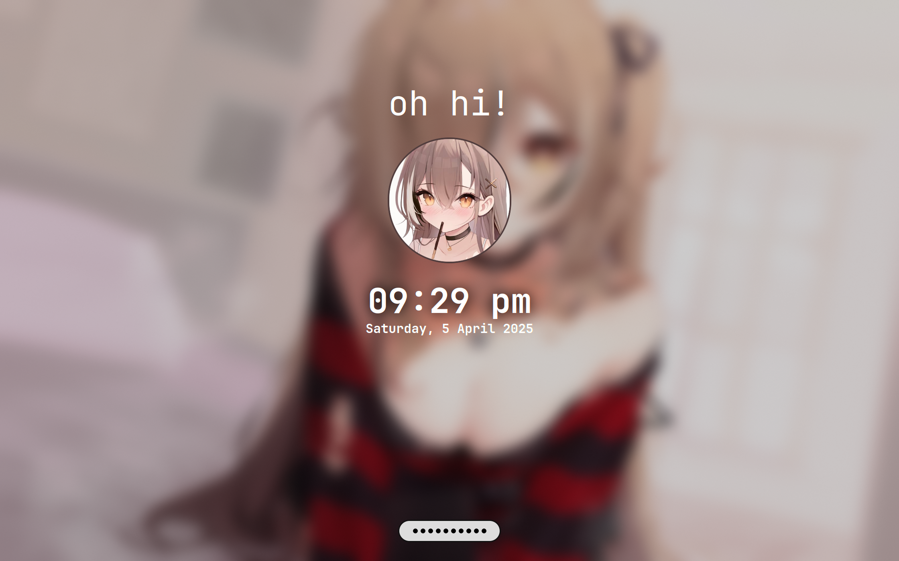

# Dotfiles

The repository containing the dotfiles for my [Hyprland](https://hyprland.org/) daily driver, featuring a [Gawr Gura](https://youtube.com/@gawrgura) theme.

# Info

| Category | Application   |
| -------- | ------------- |
| Distro   | Arch          |
| WM       | Hyprland      |
| Terminal | kitty         |
| Shell    | fish          |
| Prompt   | Starship      |
| Editor   | VSCode/Neovim |
| Browser  | Google Chrome |
| Music    | Spotify       |
| Bar      | Waybar        |
| Discord  | Vencord       |

# Showcase

  
  
  
  
  
  
  
  


> A video can be found [here](https://www.youtube.com/watch?v=b3MoRgazqk4)

# Installation

```bash
$ git clone https://github.com/FireStreaker2/dotfiles
$ cd dotfiles
$ chmod +x install.sh
$ ./install.sh
```

> Note that this script is only for Arch based distributions, but feel free to modify it yourself to fit your own setup!

## Note

The screen resolution I use is 2240x1400, which means if you use a different one some things might be in the wrong position. Feel free to fork this repository and make your own edits!

# Keybinds/Shortcuts

For a list of all the keybinds, please refer to my [hyprland.conf](https://github.com/FireStreaker2/dotfiles/blob/main/hypr/hyprland.conf) file. For waybar shortcuts, check out my waybar [config](https://github.com/FireStreaker2/dotfiles/blob/main/waybar/config).

# Credits

## Dotfiles

My dotfiles have been heavily inspired by these, and some are directly modified versions of the original

- https://github.com/prasanthrangan/hyprdots
- https://github.com/end-4/dots-hyprland
- https://github.com/zDyanTB/HyprNova
- https://github.com/SolDoesTech/hyprland
- https://github.com/7KIR7/dots
- https://github.com/Comfy-Themes/Spicetify
- https://github.com/Comfy-Themes/Discord

## Images

- [gura.png](https://twitter.com/shouu_kyun/status/1586041364457746432)
- [wallpaper1.png](https://www.pixiv.net/en/artworks/87135236)
- [wallpaper2.png](https://www.pixiv.net/en/artworks/94886012)
- [wallpaper3.png](https://danbooru.donmai.us/posts/5448225)

## Other

- [Gura SDDM](https://github.com/FireStreaker2/Gura-SDDM)
- [BlueGTK](https://github.com/FireStreaker2/BlueGTK)
- [Spotify Adblock](https://github.com/rxri/spicetify-extensions/tree/main/adblock)

# Contributing

Since these are my personal dotfiles, I won't be accepting any contributions regarding the actual configuration files. However, feel free to help edit the README or installation script!

# License

[MIT](https://github.com/FireStreaker2/dotfiles/blob/main/LICENSE)
