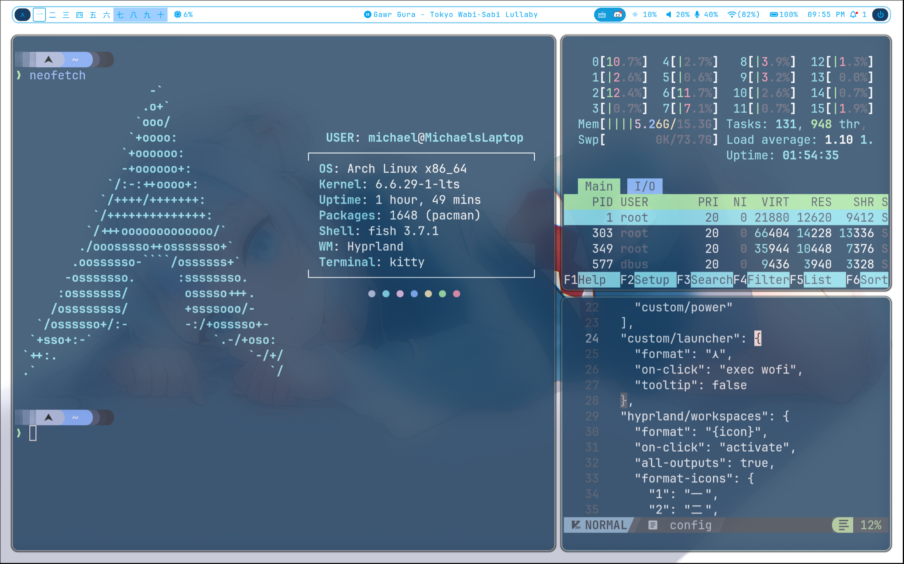
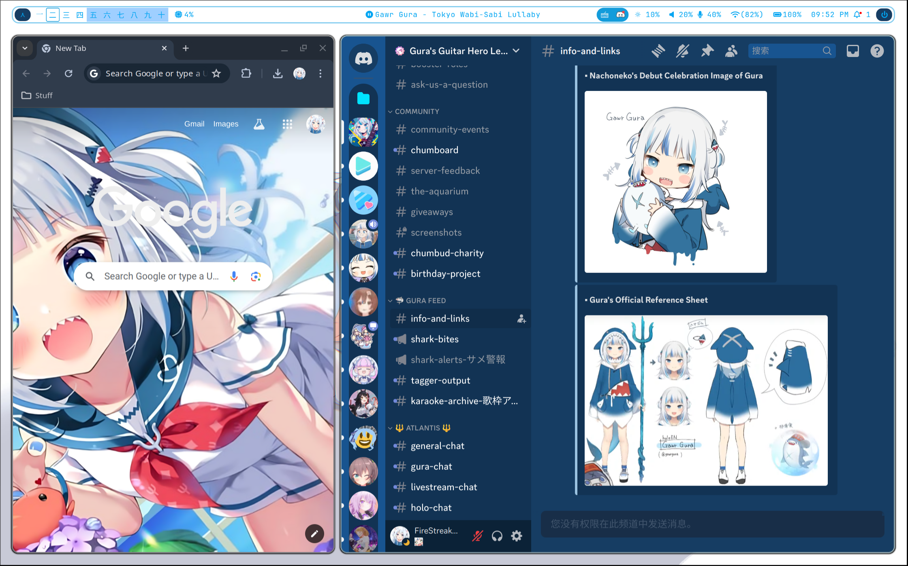
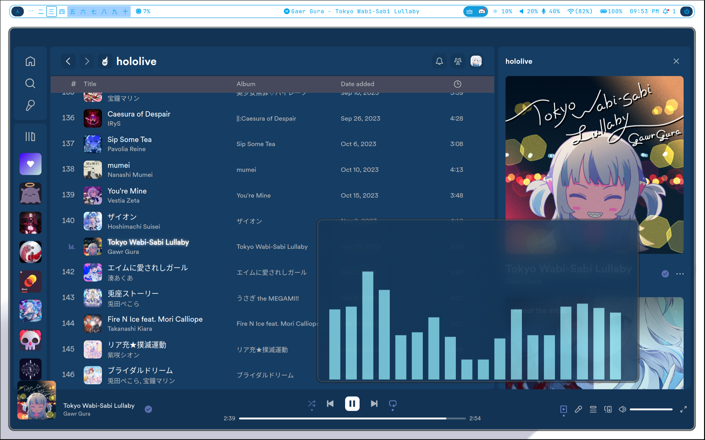
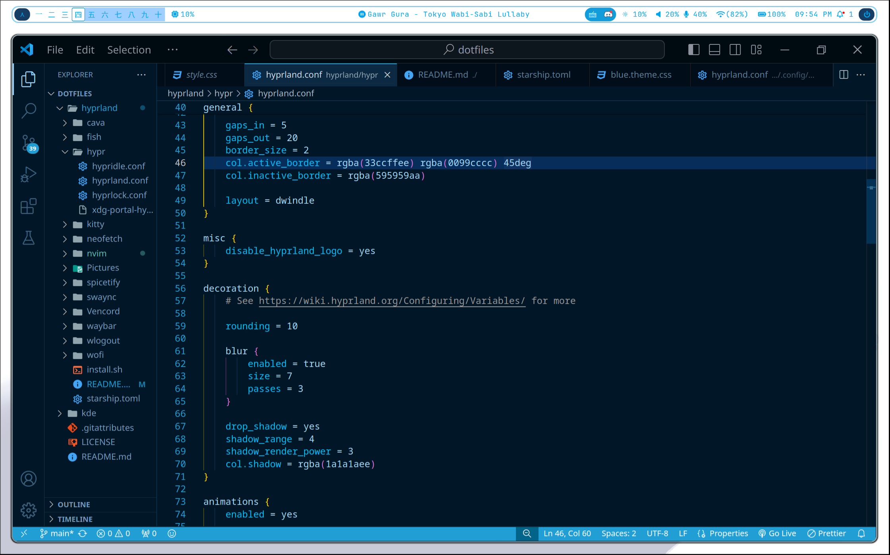
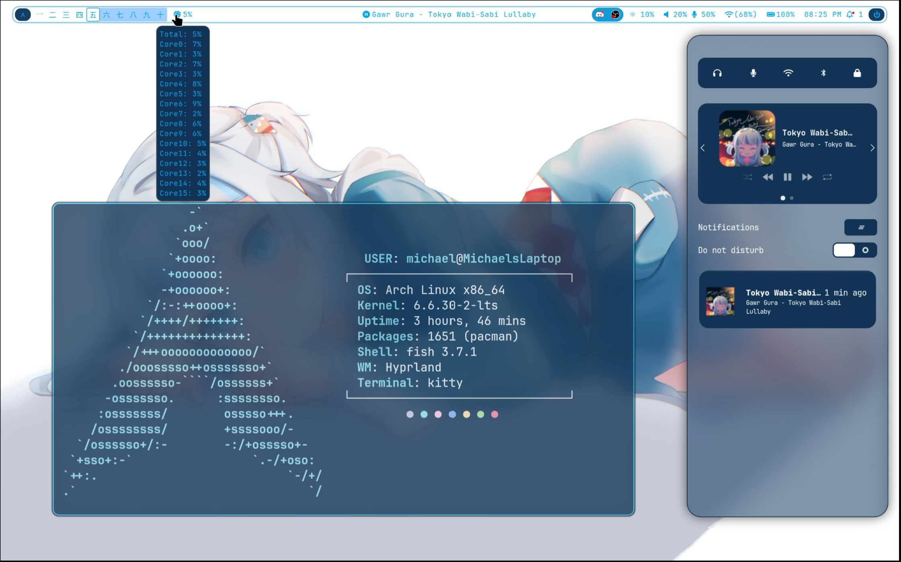
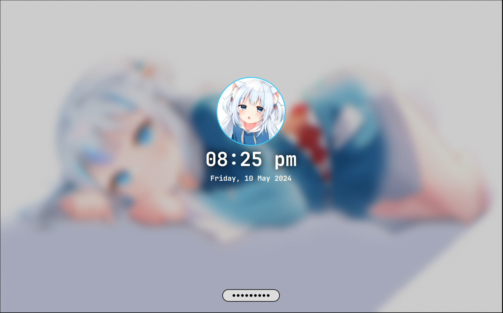
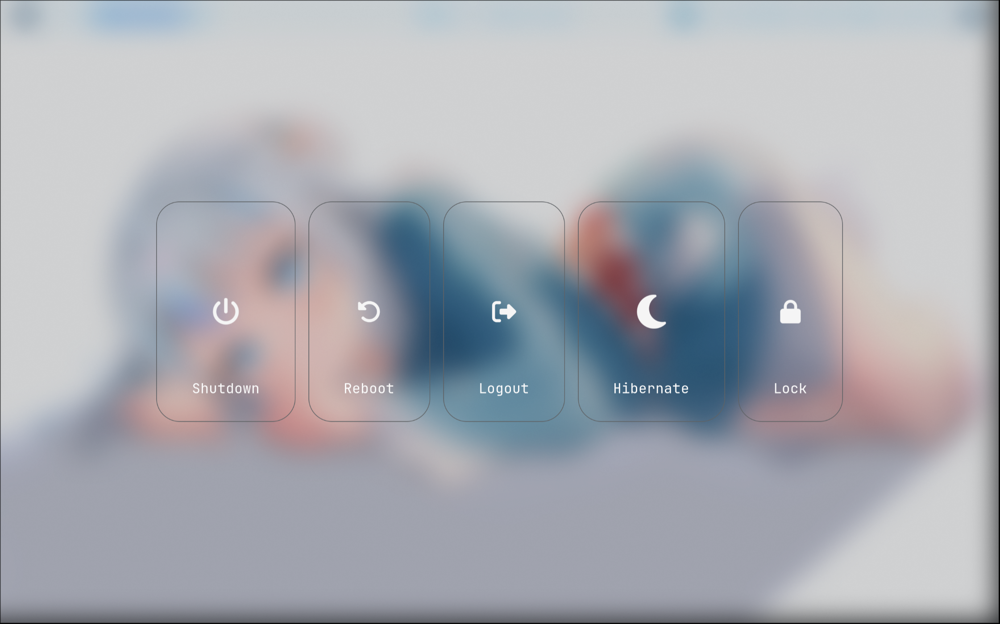

# Info
| Distro   | Arch                           |
|----------|--------------------------------|
| WM       | Hyprland                       |
| Terminal | kitty                          |
| Shell    | fish                           |
| Editor   | VSCode/Neovim                  |
| Browser  | Google Chrome                  |
| Music    | Spotify                        |
| Bar      | Waybar                         |
| Discord  | Vencord                        |

# Showcase
  
  
  
  
  
  
  
  
  

# Installation
```bash
$ git clone https://github.com/FireStreaker2/dotfiles
$ cd dotfiles/hyprland
$ chmod +x install.sh
$ ./install.sh
```

# Credits
## Dotfiles
My dotfiles have been heavily inspired by these, and some are directly modified versions of the original  

* https://github.com/prasanthrangan/hyprdots
* https://github.com/end-4/dots-hyprland
* https://github.com/zDyanTB/HyprNova
* https://github.com/SolDoesTech/hyprland
* https://github.com/7KIR7/dots
* https://github.com/Comfy-Themes/Spicetify
* https://github.com/Comfy-Themes/Discord

## Images
* [gura.png](https://twitter.com/kokoshira_0512/status/1512649948055347200)
* [wallpaper2.png](https://www.pixiv.net/en/artworks/94886012)
* [wallpaper3.png](https://danbooru.donmai.us/posts/5448225)

## Other
* [Gura SDDM](https://github.com/FireStreaker2/Gura-SDDM)
